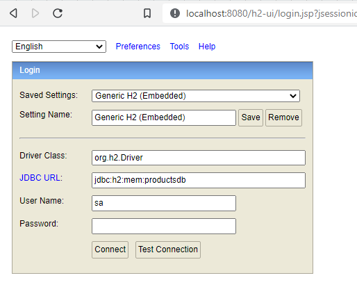

# falabella-challenge

Minimal rest api example

## Requirements

For building and running the application you need:

- [JDK 11](https://www.oracle.com/java/technologies/downloads/#java11)
- [Gradle](https://docs.gradle.org/current/userguide/installation.html)

## Running the application locally

You can run the application from your IDE or you can go in terminal to 
the root path of source and run:

In linux based systems
```shell
 ./gradlew bootRun
```
In windows
```shell
 gradlew bootRun
```
## Architecture decisions

### Layers
I'm used to work with 3 layers, so in sake of time I decided to use it.
Layers are:
- Controller
- Service
- Dao (Spring Data Jpa)

### Data validation
Because the simple rules given for validation input fields I chose Java bean validation annotations.

### DTO
To avoid dependency between input data and persistence data I'm stick with DTO pattern.<br>  
For mapping DTO to entity and backwards I decided to use [MapStruct](https://mapstruct.org/) because it has good perfomance in benchmarks and it has
integration with Spring and Lombok. <br> 

References: <br>
- <https://www.baeldung.com/java-performance-mapping-frameworks> "Performance of Java Mapping Frameworks"
- <https://mapstruct.org/documentation/spring-extensions/reference/html/> "MapStruct Spring Extensions 0.1.2 Reference Guide"
- <https://mapstruct.org/documentation/stable/reference/html/#lombok> "Mapstruct lombok"

## Database
Because this project is just like a POC I decided to use ***H2*** in mem database.<br>  
Url for local H2 web console: http://localhost:8080/h2-ui <br>  
Just use the default credentials and press Connect


## Persistence
Spring Data JPA because is widely used.

## Exceptions
To centralize handle errors I used Spring's ***Controller Advice***.
Custom exceptions were made to manage duplicated data and for not found records.

## Swagger
[Local Api documentation](http://localhost:8080/swagger-ui/index.html#/product-controller "Api documentation")
